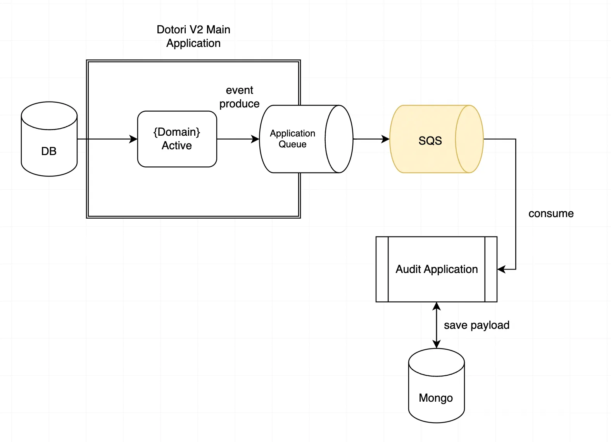

### Squirrel

Squirrel - DOTORI Audit System

### Project Description

Squirrel은 DOTORI V2의 user active를 logging하는 audit system입니다.

DOTORI(dev, prod)에서 발생한 log event payload, metric들을 조회할 수 있습니다. 

기밀정보는 확인할 수 없으며 자습 신청, 안마의자, 음악 신청, 좋아요 기록만 확인 가능합니다.

논리적 오류가 존재하는 Log가 발생하면 (ex. 자습신청 기록 하루 두번) webhook을 통해 알림을 전송합니다.